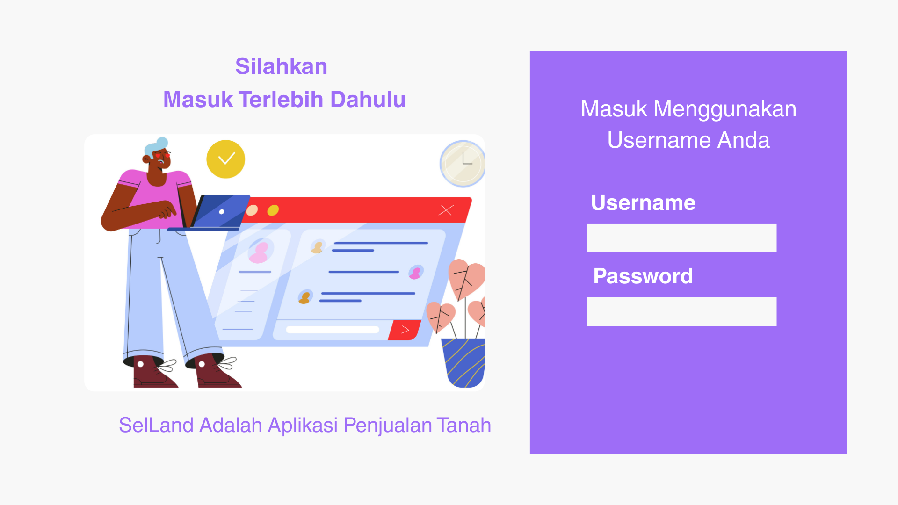
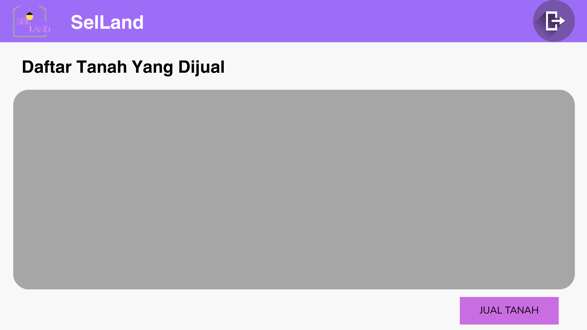

## TUGAS 4 PEMROGRAMAN VISUAL

### 🖼️ Desain Mockup

Link : https://www.canva.com/design/DAGm2Y1xt3M/rIj_hUSJSWkn4DUQnbY01A/edit?utm_content=DAGm2Y1xt3M&utm_campaign=designshare&utm_medium=link2&utm_source=sharebutton
Berikut adalah beberapa tampilan desain mockup dari aplikasi SelLand:

### Daftar 

### Login Page

### Dashboard

### Manajemen Data Tanah

