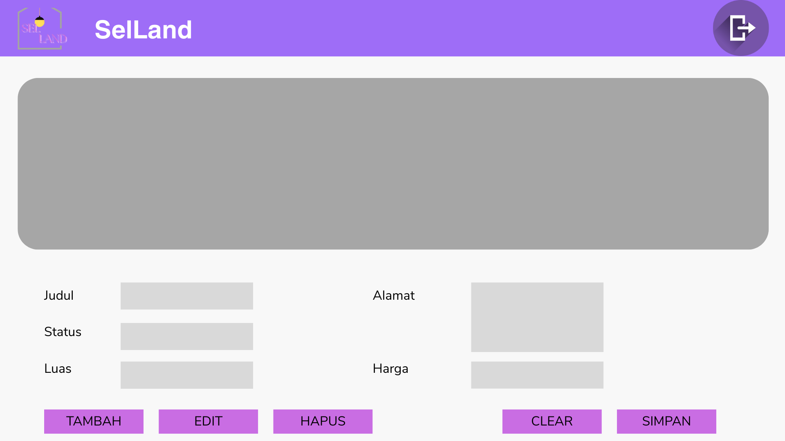
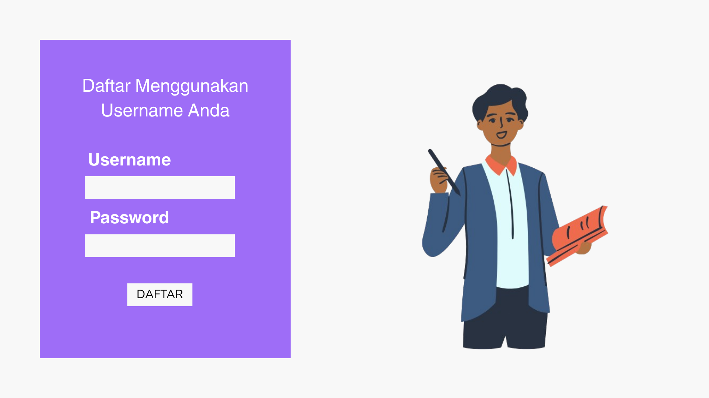
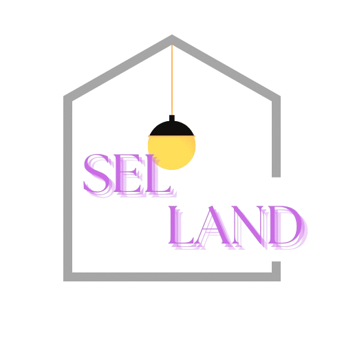

## TUGAS 4 PEMROGRAMAN VISUAL

### 🖼️ Desain Mockup

Link : https://www.canva.com/design/DAGm2Y1xt3M/rIj_hUSJSWkn4DUQnbY01A/edit?utm_content=DAGm2Y1xt3M&utm_campaign=designshare&utm_medium=link2&utm_source=sharebutton

### Berikut adalah beberapa tampilan desain mockup dari aplikasi **SelLand**:

### 🟢 Halaman Login

### 📊 Dashboard

### 📄 Manajemen Data Tanah

### 📋 Halaman Daftar Penjualan

### 🌐 Logo Aplikasi

